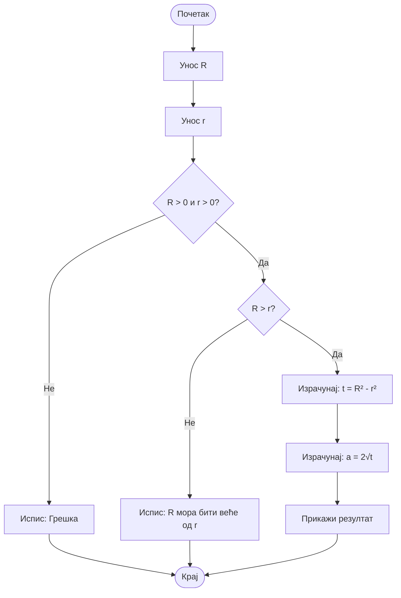

# Домаћи задатак из Техничке документације

## Задатак

Програм који на основу унетог полупречника описане кружнице R и полупречника
уписане кружнице r израчунава страницу многоугла a.

## Формула

$a = 2\sqrt{R^2 - r^2}$

---

### Алгоритамска шема



## Решење

``` cs
using System;

class Program
{
    static void Main()
    {
        Console.Write("Unesite R: ");
        string inputR = Console.ReadLine();

        Console.Write("Unesite r: ");
        string inputr = Console.ReadLine();

        
        if (!double.TryParse(inputR, out double R))
        {
            Console.WriteLine("Nevažeći unos za R.");
            return;
        }

        if (!double.TryParse(inputr, out double r))
        {
            Console.WriteLine("Nevažeći unos za r.");
            return;
        }

        
        if (R <= 0 || r <= 0)
        {
            Console.WriteLine("R i r moraju biti pozitivni brojevi.");
            return;
        }

        if (R <= r)
        {
            Console.WriteLine("Mora važiti R > r.");
            return;
        }

        
        double a = 2 * Math.Sqrt(R * R - r * r);

        Console.WriteLine($"Strana mnogougla a = {a}");
    }
}

```


### Тест примери

Тест пример 1:

``` text
Unesite R: 10
Unesite r: 6
Strana mnogougla a = 16

C:\Users\sekul\Documents\VisualStudio\ConsoleApp2\bin\Debug\ConsoleApp2.exe (process 6360) exited with code 0 (0x0).
Press any key to close this window . . .
```

Тест пример 2:

``` text
Unesite R: 20
Unesite r: 12
Strana mnogougla a = 32

C:\Users\sekul\Documents\VisualStudio\ConsoleApp2\bin\Debug\ConsoleApp2.exe (process 3964) exited with code 0 (0x0).
Press any key to close this window . . .
```

### Објекти

| Редни број | Променљива | Тип променљиве |
| ---------- | ---------- | -------------- |
| 1.         | `R`        | `double`       |
| 2.         | `r`        | `double`       |
| 3.         | `a`        | `double`       |
